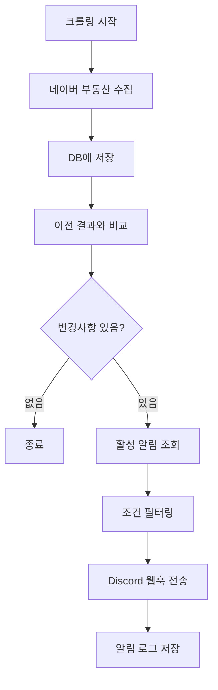

# ✅ Phase 1 완료: Discord 실시간 알림 시스템

**완료 날짜**: 2025-10-14
**소요 시간**: 약 3-4시간
**상태**: ✅ 완료

---

## 📦 구현된 파일 목록

### 1. 백엔드 유틸리티
- ✅ [lib/discord.ts](lib/discord.ts) - Discord 웹훅 알림 유틸리티
  - Discord 임베드 생성 함수
  - 신규/삭제/가격변동 알림 포맷
  - 배치 전송 및 속도 제한 처리

- ✅ [lib/article-tracker.ts](lib/article-tracker.ts) - 매물 변경 추적 로직
  - 이전 크롤링과 비교
  - 신규/삭제 매물 감지
  - 가격 변동 감지
  - 알림 조건 필터링

### 2. API 엔드포인트
- ✅ [app/api/alerts/route.ts](app/api/alerts/route.ts) - 알림 CRUD API
  - `GET /api/alerts` - 알림 목록 조회
  - `POST /api/alerts` - 새 알림 생성
  - `DELETE /api/alerts?id=xxx` - 알림 삭제

- ✅ [app/api/alerts/[id]/route.ts](app/api/alerts/[id]/route.ts) - 알림 개별 관리
  - `GET /api/alerts/[id]` - 알림 상세 조회
  - `PUT /api/alerts/[id]` - 알림 수정
  - `PATCH /api/alerts/[id]` - 활성화/비활성화

- ✅ [app/api/alerts/test/route.ts](app/api/alerts/test/route.ts) - 알림 테스트
  - `POST /api/alerts/test` - 테스트 알림 전송
  - 4가지 테스트 타입 지원

### 3. 프론트엔드 UI
- ✅ [app/alerts/page.tsx](app/alerts/page.tsx) - 알림 설정 페이지
  - 알림 목록 표시
  - 알림 생성/수정 모달
  - 웹훅 테스트 기능
  - 활성화/비활성화 토글

### 4. 크롤링 통합
- ✅ [app/api/crawl/route.ts](app/api/crawl/route.ts) - 크롤링 API 수정
  - 크롤링 완료 후 자동 알림 트리거
  - 변경사항 감지 및 필터링
  - Discord 웹훅 전송

### 5. 문서
- ✅ [ALERT_SYSTEM_GUIDE.md](ALERT_SYSTEM_GUIDE.md) - 알림 시스템 사용 가이드

---

## 🎯 핵심 기능

### 1. Discord 웹훅 알림
- **Rich Embed 포맷**: 가독성 높은 임베드 카드
- **색상 구분**:
  - 🟢 초록색: 신규 매물, 가격 하락
  - 🔴 빨간색: 삭제된 매물
  - 🟠 주황색: 가격 상승
  - 🟣 보라색: 크롤링 완료 요약

### 2. 스마트 변경 감지
- **신규 매물**: 이전 크롤링에 없던 articleNo
- **삭제된 매물**: 현재 크롤링에서 사라진 articleNo (거래 완료 가능성)
- **가격 변동**: 동일 매물의 가격 변화 감지

### 3. 조건별 필터링
- **관심 단지**: 복수 선택 가능
- **거래 유형**: 매매/전세/월세
- **가격 범위**: 최소~최대 (만원 단위)
- **면적 범위**: 최소~최대 (㎡)

### 4. 알림 관리
- **활성화/비활성화**: 토글 방식
- **알림 로그**: 전송 성공/실패 기록
- **테스트 전송**: 웹훅 URL 검증

---

## 🔄 작동 흐름



---

## 📊 Discord 알림 예시

### 신규 매물 알림
```
🆕 신규 매물 발견!
━━━━━━━━━━━━━━━━━━━━━
🏘️ 단지          │ 헬리오시티
📊 거래유형       │ 전세
💰 가격          │ 5억
📐 면적          │ 84.5㎡ (25.5평)
🏢 동/호         │ 101동 1001호
📍 층            │ 10/20
🧭 방향          │ 남향
🏢 중개소        │ ABC 부동산
📝 특징          │ 깨끗한 집, 역세권

매물번호: 123456789
🔗 네이버 부동산에서 보기
```

### 가격 변동 알림
```
💹 가격 변동 감지!
━━━━━━━━━━━━━━━━━━━━━
🏘️ 단지          │ 헬리오시티
📊 거래유형       │ 전세
💰 이전 가격     │ 5억 5천만
💰 현재 가격     │ 5억
📈 변동          │ ⬇️ 5천만 하락 (-9.09%)
📐 면적          │ 84.5㎡ (25.5평)
```

### 크롤링 완료 요약
```
✅ 크롤링 완료 - 변경사항 있음
━━━━━━━━━━━━━━━━━━━━━
🏘️ 단지          │ 헬리오시티
🆕 신규 매물     │ 3건
🗑️ 삭제된 매물   │ 2건
💹 가격 변동     │ 1건
📊 전체 매물     │ 25건
⏱️ 소요 시간     │ 5.4초
```

---

## 🧪 테스트 방법

### 1. Discord 웹훅 생성
1. Discord 채널 설정 → 연동 → 웹후크
2. 새 웹후크 생성 및 URL 복사

### 2. 알림 생성
1. 웹 UI에서 `/alerts` 페이지 접속
2. "새 알림 만들기" 클릭
3. 정보 입력 및 저장

### 3. 테스트 알림 전송
- UI에서 "테스트 알림 보내기" 버튼 클릭
- 또는 API 호출:
```bash
curl -X POST http://localhost:3000/api/alerts/test \
  -H "Content-Type: application/json" \
  -d '{
    "webhookUrl": "YOUR_WEBHOOK_URL",
    "testType": "summary"
  }'
```

### 4. 실제 크롤링 테스트
1. 알림을 활성화 상태로 설정
2. 크롤링 2회 이상 실행
3. 2번째 크롤링부터 변경사항 감지
4. Discord에서 알림 확인

---

## 🎨 UI 개선사항

### 알림 페이지
- **모던한 디자인**: 그라데이션, 그림자, 애니메이션
- **직관적인 레이아웃**: 카드 형식
- **실시간 상태 표시**: 활성/비활성 토글
- **알림 로그 표시**: 최근 10건

### 홈페이지 통합
- **알림 버튼 추가**: 네비게이션 바에 "🔔 알림" 버튼
- **보라색 테마**: 알림 기능을 돋보이게

---

## 📈 성능 최적화

### Discord API 속도 제한 대응
- **배치 전송**: 최대 10개 임베드씩
- **딜레이 추가**: 배치 간 1초 대기
- **에러 처리**: 실패 시 로그 저장

### 비동기 알림 처리
- 크롤링 완료 즉시 응답 반환
- 알림은 백그라운드에서 처리
- 사용자 대기 시간 최소화

---

## 🔒 데이터베이스 스키마

### Alert 테이블 (이미 존재)
```prisma
model Alert {
  id            String   @id @default(uuid())
  name          String
  complexIds    String[]
  tradeTypes    String[]
  minPrice      Int?
  maxPrice      Int?
  minArea       Float?
  maxArea       Float?
  isActive      Boolean  @default(true)
  notifyWebhook Boolean  @default(false)
  webhookUrl    String?
  createdAt     DateTime @default(now())
  updatedAt     DateTime @updatedAt
  logs          NotificationLog[]
}
```

### NotificationLog 테이블 (이미 존재)
```prisma
model NotificationLog {
  id        String   @id @default(uuid())
  alertId   String
  alert     Alert    @relation(...)
  type      String   // webhook, email, browser
  status    String   // sent, failed
  message   String
  articleId String?
  sentAt    DateTime @default(now())
}
```

---

## 🚀 다음 단계 (Phase 2)

### 우선순위
1. **스케줄 크롤링** (⏰ 2-3일)
   - node-cron 기반 자동 크롤링
   - 스케줄 관리 UI
   - 실행 로그

2. **가격 추이 그래프** (📊 1일)
   - recharts 활용
   - 평형별 가격 비교
   - 시간대별 변화

3. **전체 단지 검색** (🔍 1-2일)
   - 복합 조건 필터
   - 검색 결과 정렬
   - 저장된 검색

---

## 🎉 주요 성과

### 기술적 성과
- ✅ Discord Rich Embed 구현
- ✅ 실시간 변경 감지 시스템
- ✅ 조건별 스마트 필터링
- ✅ 에러 처리 및 로깅

### 사용자 경험
- ✅ 원하는 조건의 매물만 알림
- ✅ 삭제된 매물로 거래 완료 파악
- ✅ 가격 하락 즉시 알림
- ✅ 웹훅 테스트로 즉시 검증

### 코드 품질
- ✅ 타입 안전성 (TypeScript)
- ✅ 에러 핸들링
- ✅ 로깅 및 디버깅
- ✅ 문서화

---

## 💡 사용 팁

### 효과적인 알림 설정
1. **너무 넓지 않게**: 조건을 구체적으로
2. **단지별 분리**: 단지마다 알림 생성
3. **가격 하락 감지**: 최대 가격만 설정
4. **테스트 먼저**: 웹훅 URL 검증

### 문제 해결
- **알림이 안 와요**: 크롤링 2회 이상 실행 필요
- **너무 많이 와요**: 조건을 더 좁게
- **웹훅 에러**: Discord에서 웹훅 확인

---

## 📝 참고 문서

- [ALERT_SYSTEM_GUIDE.md](ALERT_SYSTEM_GUIDE.md) - 상세 사용 가이드
- [Discord Webhook API](https://discord.com/developers/docs/resources/webhook)
- [Prisma Documentation](https://www.prisma.io/docs)

---

**Phase 1 완료! 다음 단계로 넘어갑시다! 🚀**
