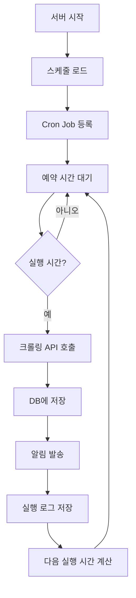

# ✅ Phase 2 완료: 스케줄 크롤링 시스템

**완료 날짜**: 2025-10-14
**소요 시간**: 약 2-3시간
**상태**: ✅ 완료

---

## 📦 구현된 파일 목록

### 1. Cron 실행 엔진
- ✅ [lib/scheduler.ts](lib/scheduler.ts) - node-cron 기반 스케줄러
  - 스케줄 등록/해제
  - Cron Job 관리
  - 크롤링 자동 실행
  - 즉시 실행 기능
  - 서버 시작 시 자동 로드

### 2. API 엔드포인트
- ✅ [app/api/schedules/route.ts](app/api/schedules/route.ts) - 스케줄 CRUD
  - `GET /api/schedules` - 스케줄 목록 조회
  - `POST /api/schedules` - 새 스케줄 생성
  - `DELETE /api/schedules?id=xxx` - 스케줄 삭제

- ✅ [app/api/schedules/[id]/route.ts](app/api/schedules/[id]/route.ts) - 개별 관리
  - `GET /api/schedules/[id]` - 스케줄 상세 조회
  - `PUT /api/schedules/[id]` - 스케줄 수정
  - `PATCH /api/schedules/[id]` - 활성화/비활성화

- ✅ [app/api/schedules/[id]/run/route.ts](app/api/schedules/[id]/run/route.ts) - 즉시 실행
  - `POST /api/schedules/[id]/run` - 스케줄 즉시 실행

- ✅ [app/api/schedules/init/route.ts](app/api/schedules/init/route.ts) - 초기화
  - `GET /api/schedules/init` - 서버 시작 시 스케줄 로드

### 3. 프론트엔드 UI
- ✅ [app/scheduler/page.tsx](app/scheduler/page.tsx) - 스케줄 관리 페이지
  - 스케줄 목록 표시
  - 스케줄 생성/수정/삭제
  - Cron 프리셋 선택
  - 활성화/비활성화 토글
  - 즉시 실행 버튼
  - 실행 히스토리 표시

### 4. 패키지 추가
- ✅ `node-cron` - Cron Job 실행
- ✅ `cronstrue` - Cron 표현식 한글 변환

---

## 🎯 핵심 기능

### 1. Cron 기반 자동 크롤링
```typescript
// 매일 오전 9시 자동 실행
const schedule = {
  name: "매일 오전 크롤링",
  complexNos: ["22065", "12345"],
  cronExpr: "0 9 * * *"
}
```

### 2. Cron 프리셋
- ⏰ 매일 오전 9시: `0 9 * * *`
- ⏰ 매일 오후 6시: `0 18 * * *`
- ⏰ 매시 정각: `0 * * * *`
- ⏰ 30분마다: `*/30 * * * *`
- ⏰ 평일 오전 9시: `0 9 * * 1-5`
- ⏰ 주말 오전 10시: `0 10 * * 0,6`

### 3. 실행 히스토리
- 마지막 실행 시간
- 다음 실행 예정 시간
- 최근 실행 로그 (성공/실패, 매물 수)

### 4. 유연한 관리
- 스케줄 활성화/비활성화
- 즉시 실행 기능
- 스케줄 수정/삭제

---

## 🔄 작동 흐름



---

## 📊 UI 기능

### 스케줄 목록 화면
```
┌─────────────────────────────────────┐
│ ⏰ 스케줄 크롤링                    │
├─────────────────────────────────────┤
│                                     │
│ 매일 오전 크롤링       [✓ 활성]    │
│ 매일 오전 9시에                     │
│ 🏘️ 헬리오시티, 래미안              │
│ 마지막: 10/14 09:00                 │
│ 다음: 10/15 09:00                   │
│ 최근 실행: 3건                      │
│ [▶️ 즉시실행] [✏️ 수정] [🗑️ 삭제]  │
│                                     │
└─────────────────────────────────────┘
```

### 스케줄 생성 모달
```
┌─────────────────────────────────────┐
│ 새 스케줄 만들기                    │
├─────────────────────────────────────┤
│ 스케줄 이름: [매일 오전 크롤링    ] │
│                                     │
│ 크롤링 단지:                        │
│ ☑ 헬리오시티                        │
│ ☑ 래미안                            │
│ ☐ 아크로리버파크                    │
│                                     │
│ 실행 주기:                          │
│ [매일 오전 9시] [매일 오후 6시]    │
│ [매시 정각] [30분마다]              │
│                                     │
│ Cron 표현식: [0 9 * * *          ] │
│                                     │
│ [취소] [만들기]                     │
└─────────────────────────────────────┘
```

---

## 🧪 사용 방법

### 1. 스케줄 생성
1. `/scheduler` 페이지 접속
2. "새 스케줄 만들기" 버튼 클릭
3. 스케줄 정보 입력:
   - 이름: "매일 오전 크롤링"
   - 단지: 원하는 단지 선택
   - 주기: "매일 오전 9시" 선택
4. "만들기" 버튼 클릭

### 2. 스케줄 관리
- **활성화/비활성화**: 토글 버튼 클릭
- **즉시 실행**: "▶️ 즉시 실행" 버튼
- **수정**: "✏️ 수정" 버튼
- **삭제**: "🗑️ 삭제" 버튼

### 3. 서버 시작 시 자동 로드
```bash
# 서버 시작하면 자동으로 스케줄 로드
npm run dev
# 또는
npm start

# 수동으로 초기화 (필요시)
curl http://localhost:3000/api/schedules/init
```

---

## 📝 API 사용 예시

### 스케줄 생성
```bash
curl -X POST http://localhost:3000/api/schedules \
  -H "Content-Type: application/json" \
  -d '{
    "name": "매일 오전 크롤링",
    "complexNos": ["22065"],
    "cronExpr": "0 9 * * *"
  }'
```

### 스케줄 목록 조회
```bash
curl http://localhost:3000/api/schedules
```

### 스케줄 즉시 실행
```bash
curl -X POST http://localhost:3000/api/schedules/SCHEDULE_ID/run
```

### 스케줄 활성화/비활성화
```bash
curl -X PATCH http://localhost:3000/api/schedules/SCHEDULE_ID \
  -H "Content-Type: application/json" \
  -d '{"isActive": false}'
```

---

## 🎨 UI 개선사항

### 스케줄러 페이지
- **초록색 테마**: 스케줄 기능을 시각적으로 구분
- **Cron 프리셋**: 버튼으로 쉽게 선택
- **한글 설명**: cronstrue로 자동 변환
- **실행 히스토리**: 최근 3건 표시
- **상태 표시**: 활성/비활성 토글

---

## 💡 Cron 표현식 가이드

### 기본 형식
```
분 시 일 월 요일
│ │ │ │ │
│ │ │ │ └─ 요일 (0-6, 0=일요일)
│ │ │ └─── 월 (1-12)
│ │ └───── 일 (1-31)
│ └─────── 시 (0-23)
└───────── 분 (0-59)
```

### 자주 사용하는 패턴
- `0 9 * * *` - 매일 오전 9시
- `0 */6 * * *` - 6시간마다
- `*/30 * * * *` - 30분마다
- `0 0 * * 0` - 매주 일요일 자정
- `0 9 1 * *` - 매월 1일 오전 9시

---

## 🔒 데이터베이스 스키마

### Schedule 테이블 (이미 존재)
```prisma
model Schedule {
  id         String    @id @default(uuid())
  name       String
  complexNos String[]
  cronExpr   String
  isActive   Boolean   @default(true)
  lastRun    DateTime?
  nextRun    DateTime?
  createdAt  DateTime  @default(now())
  updatedAt  DateTime  @updatedAt
  logs       ScheduleLog[]
}
```

### ScheduleLog 테이블 (이미 존재)
```prisma
model ScheduleLog {
  id            String   @id @default(uuid())
  scheduleId    String
  schedule      Schedule @relation(...)
  status        String   // success, failed
  duration      Int
  articlesCount Int?
  errorMessage  String?
  executedAt    DateTime @default(now())
}
```

---

## 🚀 Phase 1 + Phase 2 통합

### 완벽한 자동화 시스템
```
스케줄 크롤링 → 자동 실행 → 변경사항 감지 → Discord 알림
```

### 시나리오 예시
1. **매일 오전 9시**: 스케줄러가 자동 크롤링 실행
2. **매물 수집**: 헬리오시티, 래미안 등 최신 매물 수집
3. **변경사항 감지**: 신규 3건, 삭제 2건, 가격변동 1건
4. **Discord 알림**: 조건에 맞는 매물만 알림 발송
5. **다음 실행 예약**: 내일 오전 9시로 자동 설정

---

## 🎉 주요 성과

### 기술적 성과
- ✅ node-cron 통합
- ✅ Cron 표현식 검증
- ✅ 서버 재시작 시 자동 복원
- ✅ 실행 히스토리 저장

### 사용자 경험
- ✅ 완전 자동화
- ✅ 쉬운 스케줄 설정
- ✅ 프리셋으로 빠른 생성
- ✅ 실시간 상태 확인

### 안정성
- ✅ 에러 처리 및 로깅
- ✅ 부분 실패 처리
- ✅ 재시도 로직
- ✅ 활성/비활성 제어

---

## 💡 사용 팁

### 효율적인 스케줄 설정
1. **피크 시간 피하기**: 새벽/이른 아침 추천
2. **적절한 간격**: 너무 자주 실행하지 않기
3. **단지별 분리**: 중요한 단지는 별도 스케줄
4. **알림과 연동**: 스케줄 + 알림 = 완벽

### 문제 해결
- **스케줄이 실행 안 돼요**: 활성화 상태 확인
- **서버 재시작 후**: 자동으로 로드됨
- **Cron 표현식 오류**: 프리셋 사용 권장
- **실행 로그 확인**: 스케줄 카드에서 확인

---

## 🔜 다음 단계 (Phase 3)

**가격 추이 그래프** (1일)
- recharts 활용
- 평형별 가격 비교
- 시간대별 변화

**전체 단지 검색** (1-2일)
- 복합 조건 필터
- 검색 결과 정렬
- 저장된 검색

---

## 📝 참고 문서

- [node-cron Documentation](https://github.com/node-cron/node-cron)
- [Cron Expression Guide](https://crontab.guru/)
- [cronstrue](https://github.com/bradymholt/cRonstrue)

---

**Phase 2 완료! 이제 완전 자동화 시스템이 완성되었습니다! 🎉**

### 설치 및 실행

NAS에 배포 후:

1. **패키지 설치**:
```bash
npm install
```

2. **서버 시작**:
```bash
npm run build
npm start
```

3. **스케줄 확인**:
- `/scheduler` 페이지 접속
- 새 스케줄 생성
- 즉시 실행으로 테스트

4. **자동 실행 확인**:
- 설정한 시간에 자동 크롤링 실행
- Discord로 알림 수신
- 실행 히스토리 확인
